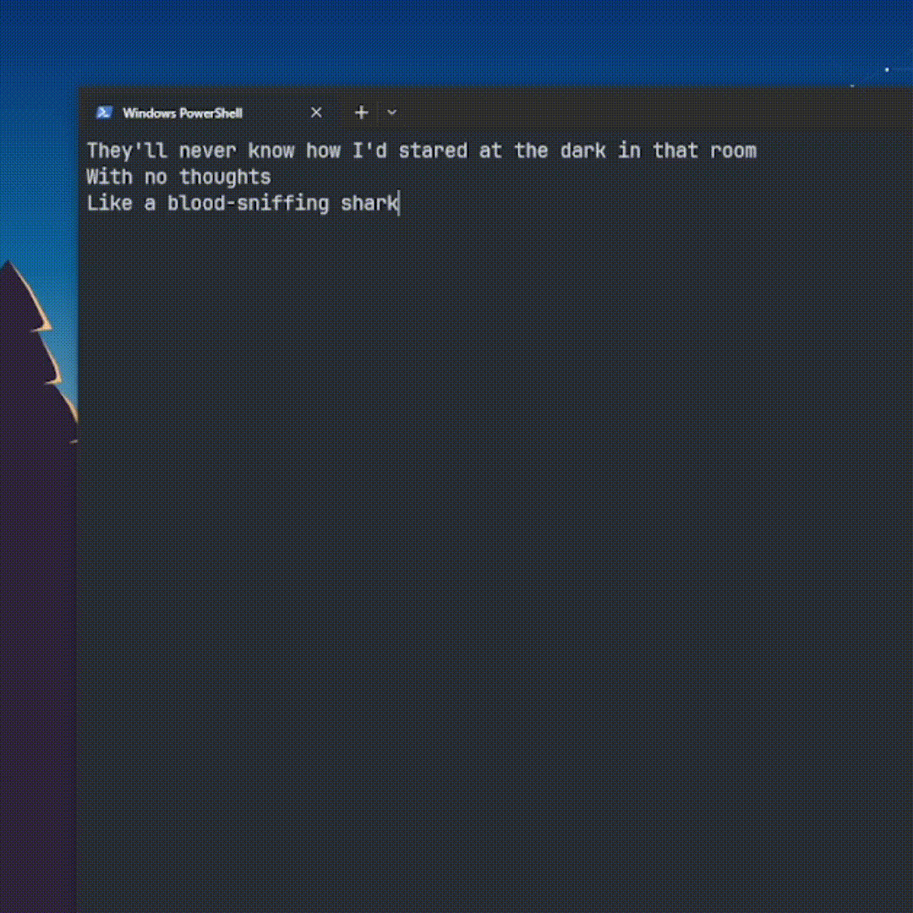

# last_words.py

Mitski's Last Words of a Shooting Star, entirely remade in a command-line interface.


# Setup

First, you'll need the song.
For copyright reasons, it wasn't included in this repo. However you can download it, put on the project root folder and rename it to "music.mp3."

Next, clone the repo, create a virtual environment and install the dependencies.

**if you're lazy:**

```
git clone https://github.com/m4c1elz/last-words-py
cd last-words-py
py -m venv venv
.\venv\Scripts\activate
pip install -r .\requirements.txt
```

Now you can run it!
`py .\main.py`

Hope you enjoy!
This is one of my first small python projects, so maybe the code might not be the best written one.
